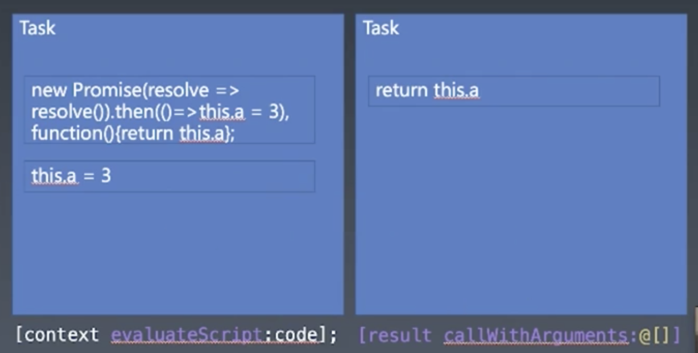

# 事件循环
js语言的调用方使用js的一种方式
```c#
while(true){
    JSContext* context = [[JSContext alloc] init];
    JSValue* result; // 存放一个js值，目的是作为参数传递给js函数
    // 触发事件，比如等待用户输入
    // 事件循环大部分时间是卡在这里 ***
    scanf("%s",&sourcecode)

    // 如果是setTimeout API，这里可能是sleep
    sleep(3000)

    // 如果在浏览器中，也可能是等待html引擎传送JS代码片段给他，一共有三种可能
    // 1. <script></script>
    // 2. <script type="module">
    // 3. setTimeout(函数)

    // 如果是setTimeout传入的函数片段，引擎会调用这个函数
    NSString* code = @"function(x){ return x * x; })";

    result = [context evaluateScript:code]; // evaluateScript：执行js代码，拿到这个jsfunction

    JSValue* arg1 = [JSValue valueWithInt32:4 inContext:context]

    NSLog(@"%@",[[result callWithArguments:@[arg1]] toString])  // 传递参数，执行函数
    // setTimeout就是把JS函数（result）和函数参数（arg1）*** 拿出事件循环 *** ，交给事件循环外面的代码进行插入队列或者等候

    // 如果有promise：

    // 如果传入的是
}
```

# 微任务宏任务：
```js
NSString* code = @"new Promise(resolve=> resolve()).then(()=>this.a=3),function(){return this.a}"

result = [context evaluateScript:code];

NSLog(@"%@", [result toString])

// 相当于result();
result = [result callWithArguments:@[]];

NSLog(@"%@", [result toString])

```

图解：
1. 外面的task是宏任务，内部代码是微任务
2. 引擎每调用一次`evaluateScript`或者一次`callWithArguments`就叫一个宏任务，即出了js引擎的叫宏任务，没出js引擎，在task里面执行的多段代码叫微任务
3. 微任务是保存在js的执行队列，在js引擎内部
3. 不只then里面的是微任务，任何task内代码首先是微任务
4. 几个微任务可能聚合到一个宏任务执行
5. 一切js代码都在微任务中执行，then可能产生一个宏任务中有多个微任务的情况
7. setTimeout是浏览器API，所以是宏任务，promise是js提供的，所以是微任务
8. promise中多少个resolve会执行，就会产生多少个微任务
9. 一次函数调用就是一次宏任务

## 如何判断执行顺序；
1. 所有resolve都加入自己的宏任务
2. 有一个resolve就产生一个额外的微任务

> 关于逗号操作符：逗号永远返回最后一个值
```js
var x = (1,2,3);
console.log(x)  // 3
```
事件循环和宏任务队列在jsContext之外
